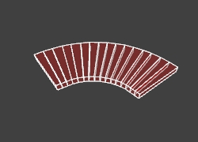

# Curve.c

[`<r0>`][r0]
[`<r1>`][r1]
[`<n>`][n]
[`<a0>`][a0]
[`<a1>`][a1]
[`<t>`][t]
[`<r2>`][r2]
[`<r3>`][r3]
[`<s>`][s]
[`<id>`][id]
[`<od>`][od]
[`<h>`][h]
[`<ct>`][ct]

Curve is a program designed to create rounded structures which can be imported directly into Radiant. The curve tool is available in the offical Windows download as `curve.exe`. An [online version](http://bilious.alt.org/~paxed/curve.js/) has been created by [@paxed](https://github.com/paxed/curve.js).

## Methods of Usage

There are six ways to use the curve program:

### Output basic usage instructions

    curve -?

This will display on-screen a quick list of parameters with brief descriptions of the purpose for each parameter.

### Output detailed usage instructions

    curve -readme

This outputs detailed instructions to the file readme.txt. This option is somewhat obsolete in light of this document, which goes into even greater detail, as well as supplying pictures to illustrate the effects of different settings.

### Command line arguments method

    curve <r0> <r1> <n> <a0> . . . > filename

This is the “classic” style of using curve. The user will enter a series of numbers to specify the properties of the curve desired, followed by a “>” and a filename to output the curve to. 

Example: `curve 256 272 64 0 720 256 8 48 384 0 0 192 1 > mycurve.map`

### Interactive method: no parameters

    curve

This method involves the user answering a series of questions about the curve that should be generated. At any point, the user may input a question mark ( ? ) in order to receive help concerning that particular setting. This method is preferable for users who dislike the ambiguity and potential confusion of such a long string of numbers as demonstrated in the example above.

### Generate file for auto-texturing of curves

    curve -textures

This creates the file textures.txt which can be easily edited to specify textures to apply to the subsequently generated curves. Please see the Texturing section for more detail.

### Random curve generation

    curve -random > filename
    
This method creates a random curve. Additionally, you may specify a second command line option ”-lots”, to generate a single file containing 16 random curves(i.e. curve -random -lots > filename). Disclaimer: Not all of the generated curves will be useful, but hopefully will serve as inspiration in level design.

## Parameters List
In the following sections, each parameter will be explained in depth, with picture examples taken straight from the editing windows in Radiant. Each picture has a caption with the exact parameters that were used to create each curve. Each file that is output by curve contains a comment header with the exact parameters used to create that curve. Simply open the file in a text editor to view the header (see this note about the header.)

### Quick reference

Parameter  | Description
-----------|-------------
[`r0`][r0] | inner radius
[`r1`][r1] | outer radius
[`n`][n]   | number of lumps (will be doubled if sloped, angled, or hill-shaped)
[`a0`][a0] | beginning angle
[`a1`][a1] | ending angle
[`t`][t]   | thickness of curve
[`r2`][r2] | ending inner radius (can be &gt;,&lt; or equal to r0)
[`r3`][r3] | ending outer radius (can be &gt;,&lt;, or equal to r1)
[`s`][s]   | vertical slope from beginning to end
[`id`][id] | vertical drop of curve's inner radius (inward angled)
[`od`][od] | vertical drop of curve's outer radius (outward angled)
[`h`][h]   | vertical drop for both ends of curve (hill)
[`ct`][ct] | zero will override default of constant thickness for angle/hill curves

### r0 - Starting Inner Radius
[r0]: #r0---starting-inner-radius

The inner radius can be any number, including zero. Zero would be useful if you are planning on creating a “disc” shape that is solid. (After importing such a “disc”, you can use the CSG Merge function in Radiant to merge the sections into a single lump). Certain advanced curves may experience small(easily corrected) glitches when the inner radius is zero.

`curve 128 256 16 0 180`

`curve 0 112 24 0 360`

`curve 0 112 24 0 360` _CSG merged_

### r1 - Starting Outer Radius
[r1]: #r1---starting-outer-radius

The outer radius can be any number as long as it is at least 1 unit larger than the inner radius [r0].

`curve 128 256 16 0 180`

	

`curve 0 112 24 0 360`

`curve 0 112 240 0 360` _CSG merged_

### n - Number of Lumps
[n]: #n---number-of-lumps

The number of lumps specified here will be the number of “sections” that your curve will be divided into. Therefore, a low `<n>` will produce a coarse curve, while a high `<n>` will produce a smoother curve.

`curve 128 192 7 0 180`

`curve 128 192 24 0 180`

It is important to note that using any of the so called “Advanced Curve Settings“ (`<s>` `<id>` `<od>` `<h>`) will double the number of lumps that you specify here. This is due to each lump being cut into two triangular pieces, necessary for it to work correctly in both Radiant and Neverball. Please note that when using advanced curve settings, it is possible to specify a number of lumps that is too high, resulting in a bumpy,coarse surface (due to alignment on the 1 unit grid), when what you wanted was a smooth one. If you find that your advanced curve/spiral/sloped curve,etc. is rougher than you wanted it to be, try a lower number of lumps – this can smooth things out.

`curve 96 128 16 0 90 16 96 128 64` _This ends up much smoother in-game, with less lumps_

`curve 96 128 30 0 90 16 96 128 64` _This curve is rough and hard to navigate in-game_

### a0 - Beginning Angle
[a0]: #a0---beginning-angle

The beginning angle can be any figure, and is expressed in degrees(360 is full circle). It's probably best to make this a positive number – negative numbers may not behave in an expected manner, and could possibly crash the program.

`curve 128 256 16 0 180`

	

`curve 128 256 16 45 180`

`curve 128 256 16 90 180`

### a1 - Ending Angle
[a1]: #a1---ending-angle

The ending angle can be any figure as well, again expressed in degrees(360 is full circle). There are no checks as to whether you enter a lower or higher number than `<a0>`, so to be safe, make it a number higher than `<a0>`. You may also go beyond 360 degrees, which can be useful when making spirals (explained further in the slope `<s>` section, under Advanced Curves)

`curve 64 128 12 0 135`

`curve 64 128 24 0 270`

`curve 192 256 64 0 720 16 192 256 256`

	 	 
### t - Thickness
[t]: #t---thickness

The thickness of the curve is expressed in radiant units, and the default is 16 – a common height for a platform. You may specify any number for <t> as long as it is at least 1 unit. Thickness of a curve is easily adjusted in Radiant. This number plays a more important role when creating "advanced" curves, especially ones that use `<id>`, `<od>` or `<h>`).

`curve 64 128 16 0 90 8`

`curve 64 128 16 0 90 32`

	 

### r2 - Ending Inner Radius
[r2]: #r2---ending-inner-radius

The ending inner radius can be any number, greater than, equal to, or less than the starting inner radius `<r0>` including zero. This can be especially useful for creating various spirals, and swirls, or creating a curve that grows wider or more narrow from one end to the other.

`curve 0 32 64 0 1080 16 224 256`

`curve 64 256 16 0 180 16 192 256`

`curve 256 288 16 0 180 16 0 32`

### r3 - Ending Outer Radius
[r3]: #r3---ending-outer-radius

The ending outer radius can be any number as long as it is greater than the ending inner radius `<r2>` by at least 1 unit. Not surprisingly, this setting is also useful when creating spirals, swirls, and curves of varying width from one end to the other.

`curve 144 256 36 0 540 16 32 64`

	

`curve 64 128 16 0 225 16 64 256`

`curve 128 256 24 0 180 16 16 48` _doubled and rotated in Radiant_

## Advanced Curve Settings

### s - Slope
[s]: #s---slope

The slope specifies the total number of units to change vertically between the beginning and end of the curve. It can be any number, including zero, and negative numbers (which will move “down” from the beginning to the end). Why zero? Two reasons: First, you might want to only use some of the other advanced settings, `<id>`, `<od>` or `<h>`, but not have a slope. Second, if you plan on rotating your curve in an unusual way in Radiant, it might be advantageous to have it split into more pieces (with the doubled number of lumps `<n>`), so it can be aligned to the 1 unit grid more easily after rotation. If you specify *anything* for the slope, you can count on having the `<n>` doubled. It is also worthy of note that while you can specify any value for the slope `<s>` that you wish, and you will get a nice smooth ascent(or descent) - for perfect results, make the value for `<s>` be a multiple of the number of lumps `<n>`. (e.g. Slope of 80 will be a little smoother vertically with 20 lumps than with 24.)

`curve 128 192 12 90 180 16 128 192 64`

`curve 384 512 64 0 1080 16 128 160 256`

`curve 512 520 32 0 360 256 512 520 320` _rotated 90 deg. on the Y-axis in Radiant for a loop-de-loop_

### id - Inner Drop
[id]: #id---inner-drop

The inner drop parameter is how many units to drop the top level of the inside of the curve. It must be at least one unit less than the total thickness `<t>`. This figure is subtracted from the thickness parameter, and the result is that your curve will be angled inward. This option can combine nicely with hill `<h>` option, to create banked curves, similar to what you might see at a race track.

`curve 128 256 8 0 90 48 128 256 0 32`

`curve 128 256 8 0 90 48 128 256 0 32 0 32` _the same curve using the “hill” option_

`curve 768 1024 80 0 900 64 256 320 -512 48`

### od - Outer Drop
[od]: #od---outer-drop

The outer drop parameter is how many unit to drop the top level of the outside of the curve. Just as with the inner drop <id>, the outer drop must be at least 1 unit less than the thickness <t>of the curve. The result will be a curve which is angled outward.

`curve 128 256 8 0 90 48 128 256 0 0 32`

`curve 128 256 8 0 90 48 128 256 0 0 32 0 0` _same curve with constant thickness `<ct>` off_

### h - Hill
[h]: #h---hill

The hill value specifies the amount to drop the top level of the ends of the curve. The middle of the curve will be the full value of thickness <t> while the ends will have a thickness equal to `<t>` minus `<h>`. The hill curve is a sine wave, which provides for a smooth transition.

`curve 128 256 16 0 180 64 128 256 0 0 0 48`

`curve 96 192 24 0 180 128 96 192 0 0 0 112` _cut in half, then copied and pasted in Radiant_

`curve 512 576 64 0 720 256 128 192 160 0 0 240`

### ct - Constant Thickness
[ct]: #ct---constant-thickness

The default for constant thickness `<ct>` is 1, which means on. You can specify 0 to turn it off. Its default function is to compensate for the `<id>`, `<od>` , and hill `<h>` values, so that you can have a curve that has a constant thickness from beginning to end, even when it is angled, or hill shaped. It could be desirable to have an angled curve or hill where the thickness is not adjusted.

`curve 128 256 8 0 90 48 128 256 0 32 0 0 0`

`curve 128 256 16 0 180 64 128 256 0 0 0 48 0`

##Texturing

The curve program will look in a file called textures.txt for information about the textures that should be automatically applied to the different parts of the curve. The following is generated in textures.txt when you run the curve program with the -textures option:

    TOP invisible
    BOT invisible
    IN invisible
    OUT invisible

You can replace the “invisible” (which is the default texture) with the name of any texture that resides in the mtrl folder. Only put the shader name in and not any file extension (e.g. turf-grey , not turf-grey.jpg).

If the textures.txt file is not present (in the same directory as curve.exe), all textures will be set to invisible.

The textures for the hidden faces, which should be invisible, are always set to the invisible texture.

The beginning and end sections of the curve will have an invisible face. This is the default behavior, since most curves will be placed next to other structures in the level. If you wish a texture on those faces, it is easy to select them in Radiant and apply one.

##Header

Each curve file that is generated by the curve program contains a comment header with all of the parameters that went into creating that specific curve. In the case of “non-advanced” curves, the header will contain more info than is necessary to recreate the curve. For instance:

If you create a curve with the following command:

    curve 128 256 16 0 180 8 64 128 > mycurve.map

The header will say your curve was created with the following parameters:

    curve 128 256 16 0 180 8 64 128 0 0 0 0 1

However, if you re-input those exact numbers, you will end up with a curve that has twice as many lumps `<n>` as necessary, due to the zero being explicitly specified for the slope `<s>`.

Therefore, please be aware of the issue that a simple curve does not need to have all of the parameters entered from the header to recreate it, and that it could be potentially undesirable to do so.

##Radiant Map Importing and Caching

Some versions, perhaps all, of Radiant will create a copy of imported .map files in memory. This only becomes a problem if you are trying to fine-tune a curve, and decide to over-write an existing .map file. If you import a .map into Radiant, over-write the .map, and then try to import it again right away, you will get exactly the same .map that imported the first time. The curve program really has overwritten the .map with your new curve, but Radiant has somehow cached the first version of it.

- **Solution 1**: Close your currently open map in Radiant, and then re-open it. This somehow “resets” the caching behavior, and you can correctly import your new curve.

- **Solution 2**: Give each curve a unique filename upon creation. You might try a xx-1, xx-2 approach to naming the curves – that way, you know the order in which they were created, and can reload an older version of your curve if you change your mind about your latest version.

Be aware of this behavior when importing your curves to avoid unnecessary confusion.
