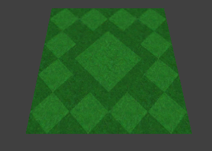

#Editing Recommendations

There is a lot more to a Neverball map than a collection of lumps and entities. The quirks and details of Neverball mapping are not obvious. They are generally only learned through experience. Many players have submitted maps, and pretty much everyone consistently makes the same mistakes. The following sections describe these mistakes, and lay down guidelines that should be followed during map creation. These are what separate a good map from a bad map.

##Physics

The Neverball physics engine can take pretty much anything you throw at it without breaking down, but there are a few problem areas.

If a ball gets squished by a moving object, it will probably end up moving into and through a solid, possibly getting stuck there. There's just no easy solution to this problem. The physical analogue would be to have the offending moving object stop moving. But then what? Nothing moves, nothing changes, and the problem certainly doesn't resolve itself.

Currently, the best solution is to stick with the unreal behavior. At least it keeps things moving. Mappers should actively avoid creating situations in which this unreal behavior is made apparent.

If you have an elevator moving up and down, prevent the ball from standing underneath. Either make the elevator shaft a solid (potentially invisible) object, or make it a bottomless pit.

If you have platforms moving horizontally, for example a ferry across a gap, ensure that a ball falling off the platform into the gap falls all the way out of the platform's path by making the gap deep.

If you have a Quake-ish crusher, delete it. There's just no place for something like that in Neverball because the ball doesn't “die”, it merely falls.

Finally, try to keep your lump counts in a reasonable range. In the mapc output, the lump count is the last number on the last line. In this example, the number of structural lumps is 115.

    mtrl  vert  edge  side  texc  geom  lump  path  node
      10   552  1086   130   277   854   132     0    33
    body  coin  goal  view  jump  swch  ball  char  indx
       1    18     1     1     0     0     1    84  4286   115
A map with many lumps requires greater processing power in-game. If a map has too many lumps, then players with older hardware will not be able to play it. In the default map set, the most complex level has 585 structural lumps. This is probably too many. Try to keep it under 500.

##Z-Fighting

Z-Fighting is one of the most basic mistakes you can make, yet people do it all the time. It occurs when two textured surfaces coincide. The Z-buffer usually indicates which surface is in front, and allows only that one to be visible. However, when surfaces coincide, numerical precision errors crop up. The answer to the question “Who is in front?” is not guaranteed to be consistent across the entire surface.

Here, the top surfaces of the green and grey lumps are coincident.

##T-Intersections

T-intersections are another really common mistake. The meaning of the term “T-intersection” should be pretty obvious from the image below. It is an instance where a vertex of one lump falls along the edge of another lump.

T-intersections are bad because they can result in “polygon cracking”, or single pixels of background color that seem to shimmer randomly along the edge in question. This occurs because edges are drawn as linear interpolations between vertices. Even though vertices may be co-linear, there is no numerical guarantee that every pixel in the linear interpolation between one pair of vertices will coincide with the pixels of the interpolation between another pair. Those pixels where the interpolation does not coincide appear as cracks.

Ensuring that a map has no T-intersections often requires planning and forethought. After you've decided how a surface should be shaped and how textures should be laid out on it, it is often a puzzle to determine how this shape should be subdivided into lumps. An intersection-free map often has many more lumps than the same map would otherwise have, but a clean map is worth the extra geometry.

  

This is a surface with 3 textures. First with a T-intersection, second with the T-intersection removed.

##"Caulking"

Quake engine mappers are certainly aware of the notion of caulking. Caulking involves marking the surfaces that the user will never see as invisible. In normal Quake editing, this is done by setting the surface texture to a bright pink texture named “caulk”. In Neverball, we use a white grid texture called “invisible”.

The invisible texture should be used anywhere two lumps are placed side to side. There is no circumstance under which the player will see the faces between the lumps, so it is inefficient to render them. By marking them as invisible, you improve the efficiency of your map, and therefore the performance of the game.

In fact, the author starts out by selecting ALL lumps and applying the invisible texture globally. He then goes back and re-textures only the visible sides. Perhaps this is a bit extreme, but it guarantees that all unseen sides will be marked invisible.

  

Here, the near side of the green lump is caulked, because the grey lump prevents it from ever being seen.

##Detail Lumps

There are many occasions where the mapper may want to define geometry that be seen, but that does not affect the ball. This is called detail geometry.

Detail lumps have two major uses. One is the application of decal textures, discussed below. The other is performance. If you define visual entities that the ball can never touch in normal game-play, you should mark them detail. The physics code will then be able to ignore these lumps and the game will perform better.

Lumps may be marked as detail by selecting the “Selection / Make Detail” menu option in radiant. Detail lumps are returned to normal with “Selection / Make Structural”.

##Decals

There are a number of occasions where you'll want to apply one texture over-top another. Examples include goals, jumps, switches, and arrows. It's common to have a goal texture appearing in green turf, or red turf, etc, but it is inefficient to use a different texture map for each ground/decal combination.

To accomplish this, we apply the decal texture just above the base texture using a second lump. Mark the top of this lump with the decal texture and mark the other 5 sides with the invisible texture.

Position the decal lump 1 unit above the base lump. Do not position the top of the decal lump coincident with the base lump, as this will cause Z-fighting.

Very important: mark the decal lump as detail using the “Make Detail” menu item. If the decal lump is allowed to be structural then the ball will bump into it, as it is 1/64th of a meter from the floor.

  

This is a decal lump by itself, and the same decal lump with the surface lump to which it is applied.

##Mitering

Mitering is a common technique for joining lumps at corners. It simply involves cutting lumps at 45 degree angles, as in a wooden picture frame. It has the effect of reducing T-intersections, while minimizing lump counts.

Mitering is most useful when you're trying to work your way around a non-trivial texture layout, as in the example below.

Mitres can be created using radiant's edge editing tool (press 'e' to enable) or clipping tool (press 'x' to enable). See the radiant documentation for the details of these functions.

This is our desired texture layout, a large diamond surrounded by small diamonds.

  

The unmitered map uses 9 lumps, while the mitered map yields the exact same texture layout using only 5 lumps.

##Trimming

Interesting texturing is important to the overall visual appeal of a level, and it doesn't really take much effort or thought at all. New mappers often think more about their geometry than their textures. They design a level and just plunk down some arbitrary materials. It looks like this:

At the very least make sure the side texture differs from the surface texture, just to accentuate the discontinuity.

Better yet, invest a few extra lumps trimming your surfaces. Each of the default surfaces textures has a corresponding trim texture. Trimming has the effect of pointing out the edge of a surface, while adding an amount of visual appeal through simple variety.

The visual impact there is not of a green object, but of a stone or concrete object with turf applied to the top.

##Coin Padding

A coin pad is a special surface texture that indicates the presence of a coin. Coin pads are not absolutely necessary, but they add a great deal of variety and visual appeal, and they contribute strongly to the appearance of polish and finish in a level.

Coin padding will almost certainly increase the complexity of the layout of a surface. Proper padding may require some creative lumping and mitering in order to keep T-intersections from cropping up. However in the end, the extra complexity pays off.

##Texture alignment and sizing

The size and tile pattern of each texture implies a default placement and a style of usage. The implied usage of each texture should be recognized and exploited at every opportunity.

For example, a 256×256 texture, such as the large green diamond, is 2 meters wide in-game, thus it is appropriate for use in tiling objects that are a multiple of 2 meters in size. Likewise, the small green diamond texture repeats every 128 pixels, and is appropriate for tiling 1-meter objects.

Of course these rules are not enforced. But if textures are applied in the manner in which they “want” to be applied, then they work together much better.

Here, a texture is applied to an object that is a bit too small. The repeating pattern is cut off. If trimming were added, or another texture applied to an adjacent lump, there would be an obvious discontinuity.

Here, the object is sized properly, but it does not fall along a 1-meter grid line. Thus, the texture is misaligned. This problem may be solved on a surface-by-surface basis using radiant's surface editor. However it is usually easiest just to align objects along the default texture lines. If a group of surfaces are not consistently aligned, another discontinuity will appear.

Here, a 2-meter object is aligned to the 1-meter grid. The texture lays naturally across it, and the mapper need not do anything different.

A user playing the game will probably not notice the difference if a platform is 2 meters wide instead of 1.8 meters wide. However, he WILL notice if a texture does not line up properly with its neighbors.

##Reflective surfaces

Neverball supports a very limited form of reflective surface. A reflective surface must be defined with two properties. First, the surface must have a reflective material type, as defined in the material file. Second, the surface must be flat with a Z value of 0.

This means that reflection is limited to shiny flat floors. There can be no upright mirrors, or mirrors on ramps, or multiple levels of mirrors, or crazy halls of mirrors.

Mappers should keep in mind that heavy use of mirrors can kill performance on weaker hardware. However, the author doesn't give a damn. That's why he implemented the option to turn reflection off. All you crybabies can go buy a better video board.

##Transparent surfaces

Neverball is capable of correctly drawing transparent surfaces in most contexts. It does sort transparent objects correctly with respect to opaque objects. However, it does NOT sort transparent objects with respect to other transparent objects.

This means that if one is looking through a pane of glass at a wall then the wall and the glass are guaranteed to be displayed correctly. But when looking through one pane of glass at another pane of glass, there is no guarantee that ether pane will be correctly rendered.

Mappers are advised to keep transparent objects to a minimum in order to avoid the inconsistencies that can result. It should be noted however that Mehdi flagrantly violates this rule in nearly every level he makes, and the author doesn't mind too much.

##Curves

Neverball does not have any explicit support for curved surfaces. All of the curves in the default level set are made up of a large number of small planar lumps generated by the curve program.